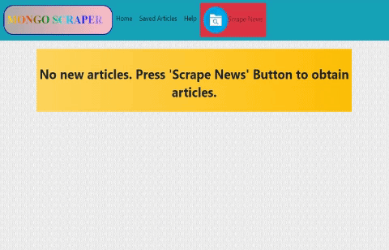
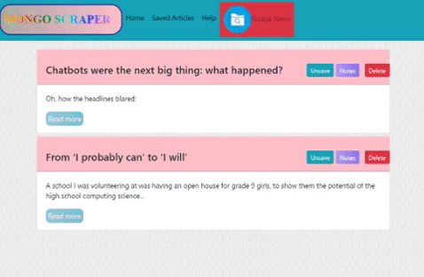

# Technews

## Description

Technews scrapes technology news articles from the medium.com website. This app that lets users view the news articles and leave notes or comments on the latest tech info.

## How Technews Works

The web app contains a home section, a saved articles section and a scrape button, as well as a help button. If there are no news articles present in the mongo database that stores the scraped articles, the user can acquire articles by pressing the 'Scrape News Button'. While the app is retrieving the articles, a loading image shows up. A popup modal appears informing the user of how many articles were able to be scraped.



The articles then appear with title, summary, a link to read the actual content of the entire article and a save button. The user has the choice of saving the article. In the 'saved articles' section of the app, the saved article appears and the user can delete or take notes on the article. Several notes can be associated with one articles. Notes can be updated or deleted. Yet another option availabe is to 'unsave' an article.



## Technologies Used

Front end:

1. Javascript

2. CSS and HTML

Backend:

1. Mongo db (mongoose) to store data

2. Nightmarejs to scrape. Nightmare was chosen because of its wait and scroll function; this gives the app the capability of loading the original url's javascript created articles. Otherwise, only a few articles would be scraped.

3. Cheerios

4. Nodejs express to handle the routes

5. Morgan to log

6. Handlebars for template views

## Installation

This app can be cloned and installed following the procedure below.

1. Now we are ready to clone this app by running the following command. `git clone git@github.com:f-flores/technews.git` Note that if `git` and `node` need to be installed, the steps to do so are the following: a) git must be installed. [Download git.](https://git-scm.com/downloads) and b. nodejs must also be installed. [Download nodejs](https://nodejs.org/en/download/)

2. Since this file makes use of several node modules, please run `npm install`.  This installs all of the dependencies.

3. `Technews` is a full stack app that uses nodejs and express on the back end. It needs to be deployed to on a platform that provides (like Heroku) "back-end" support. [Guide to deploying a Node Web Server on Heroku](https://github.com/RutgersCodingBootcamp/RUTSOM201801FSF4-Class-Repository-FSF/blob/master/13-express/Supplemental/HerokuGuide.md)

4. Add free mLab provision to project in order to have mongodb functionality with the following command: `heroku addons:create mongolab`.

## Comments

The source code for the Technews app was added to the following github repository:
[Github repo](https://github.com/f-flores/technews)

A link to the app on heroku:
[Technews App](https://infinite-earth-55385.herokuapp.com/)

## Instructions for Running NightmareJS on Heroku

<p align="center">
  
 </p>


# NightmareJS on Heroku <a href="https://heroku.com/deploy" target="_blank"></a>

[](https://github.com/oscarmorrison/nightmare-heroku/issues)
[](https://github.com/oscarmorrison/nightmare-heroku/blob/master/LICENSE)  [](https://github.com/oscarmorrison/nightmare-heroku/issues)


## Deployment of NightmareJS on Heroku

[NightmareJS](http://www.nightmarejs.org/) is an awesome highlevel webscraping and browser automation library built ontop of electron. This repo is a good starting place to be able to use it with some default setups ontop of heroku using the following instructions. [Read more](http://blog.oscarmorrison.com/nightmarejs-on-heroku-the-ultimate-scraping-setup/)

## Getting started

Template for project. Note that once project is cloned, the URL and `wait()` lines in index.js must be changed because the original html does not exist at the time of this writing.

- `git clone --depth 1 git@github.com:oscarmorrison/nightmare-heroku [new-project-name]`

- `cd [new-project-name]`
- `rm -rf .git`
- `git init`
- `heroku create [app-name]`
- `heroku stack:set cedar-14`
- set build packs
```
heroku buildpacks:add --index 1 https://github.com/heroku/heroku-buildpack-apt &&
heroku buildpacks:add --index 2 https://github.com/captain401/heroku-buildpack-xvfb.git &&
heroku buildpacks:add --index 3 https://github.com/causztic/heroku-electron-buildpack.git &&
heroku buildpacks:add --index 4 https://github.com/heroku/heroku-buildpack-nodejs.git
```
- `git push heroku master`
- `heroku ps:scale web=1`
